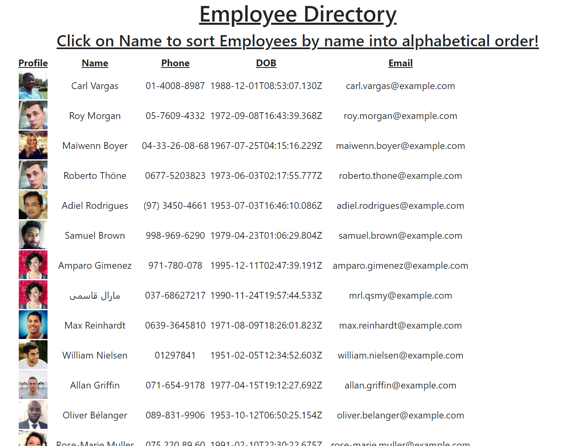

# employee-directory

## Description
Week 19 Employee Directory

## Table of Contents
- [Description](description)
- [Installation](Installation)
- [Usage](Usage)

## Installation
You can clone this repo. Then in your terminal, run the command `npm i` to install dependencies. To start the app just run `npm start`, then navigate on a web browser to localhost:3000 and you can run the app locally!

## Usage
Go to the live url, or localhost:3000 if you're using the app locally. You can click on the "name" column to sort employees by name alphabetically.

[Live Site](https://stormy-citadel-97592.herokuapp.com/)

